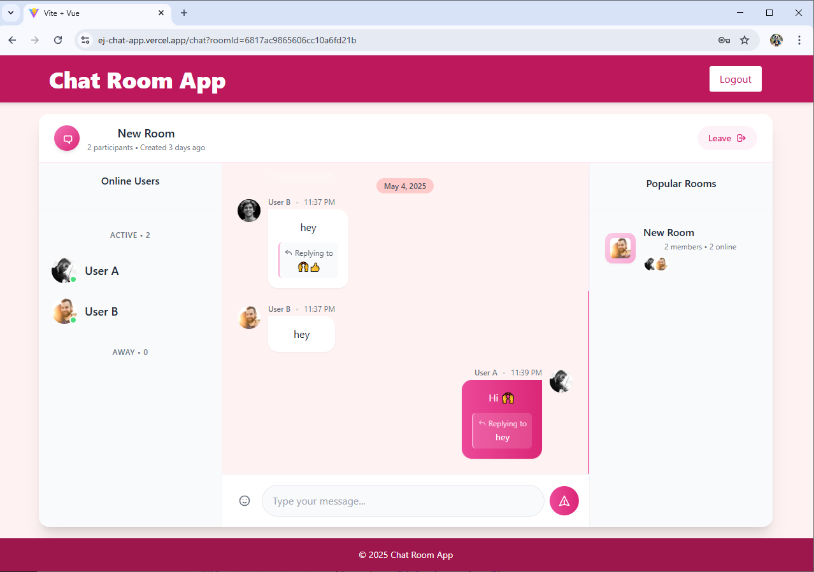
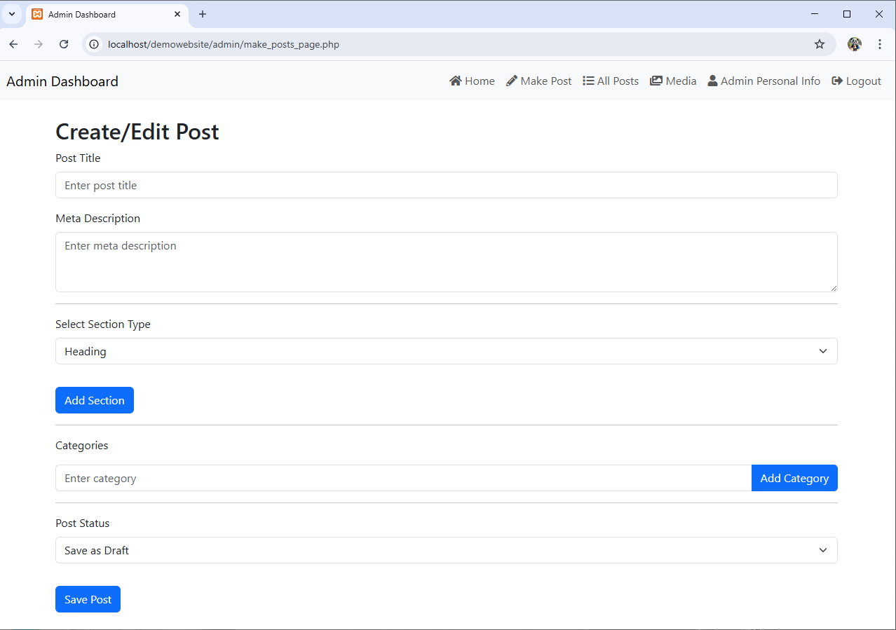

<div align="center">
  
  # Hello World! I'm Ekagra 
  
  <a href="https://ej2601.github.io/portfolio/">
    
  </a>
  <a href="https://www.linkedin.com/in/ekagra-jain-39b7b8327/">
    
  </a>
  <a href="https://x.com/ultrapythonic">
    
  </a>
  <a href="mailto:ekagra26012001@gmail.com">
    
  </a>
  
  ### Full-Stack Web Developer
  
  <code>const developer = { passion: "Building elegant solutions to complex problems" }</code>
  
</div>

<br/>

<div align="center">
  
</div>

## 👨‍💻 About Me

```javascript
const aboutMe = {
  recentProject: "IndiGalleria - Art Gallery & E-commerce Platform",
  techStack: "React + React Router + React Bootstrap + Styled Components",
  learning: ["Next.js fundamentals", "Advanced React patterns"],
  lookingToCollaborate: "Open-source projects in React & Next.js",
  philosophy: "Clean code, elegant solutions, exceptional user experiences"
}
```

I love turning complex problems into simple, beautiful, and intuitive solutions. When I'm not coding, you can find me exploring new technologies and seeking ways to improve my craft.

## 🛠️ Tech Arsenal

<div align="center">
  
#### Frontend
  


  
#### Backend
  


  
#### Database & Tools
  


  
</div>

## 📂 Featured Projects

<table>
  <tr>
    <td width="50%">
      <h3>MyCafe – AI Image Generation Platform</h3>
      <div>
        
        <p>
          An AI-powered platform for generating and sharing creative images with a robust community system. Features include image customization, collections, and social sharing.
        </p>
        <p><strong>Tech Stack:</strong> Laravel, Tailwind CSS, Alpine.js, MySQL</p>
        <p>
          <a href="https://github.com/ej2601/image_generation_platform">
            
          </a>
          <a href="https://youtu.be/XiYhNvjR6wY">
            
          </a>
        </p>
      </div>
    </td>
    <td width="50%">
      <h3>Real-Time Chat Application</h3>
      <div>
        
        <p>
          A modern chat platform with real-time messaging, user presence indicators, and notifications. Includes features like message history, typing indicators, and file sharing.
        </p>
        <p><strong>Tech Stack:</strong> Vue 3, Node.js, WebSockets, MongoDB</p>
        <p>
          <a href="https://github.com/ej2601/ej_chat_app">
            
          </a>
          <a href="https://ej-chat-app.vercel.app/">
            
          </a>
        </p>
      </div>
    </td>
  </tr>
  <tr>
    <td width="50%">
      <h3>Dynamic Blog CMS</h3>
      <div>
        
        <p>
          A full-featured content management system with advanced media management, SEO tools, and customizable themes. Built for performance and flexibility.
        </p>
        <p><strong>Tech Stack:</strong> PHP, Bootstrap, MySQL, JavaScript</p>
        <p>
          <a href="https://github.com/ej2601/BlogCMS">
            
          </a>
          <a href="https://youtu.be/8qj47LbH4ms">
            
          </a>
        </p>
      </div>
    </td>
    <td width="50%">
      <h3>IndiGalleria - Art Gallery & E-commerce Platform</h3>
      <div>
        
        <p>
          IndiGalleria is a comprehensive art gallery and e-commerce platform that connects artists, buyers, and resellers. The application allows users to browse and discover artworks, purchase original art and prints, create and manage artist profiles, participate in virtual exhibitions, read art-related blogs, manage wishlists and shopping carts, track orders, and connect with the community.
        </p>
        <p><strong>Tech Stack:</strong> React 18.3.1, React Router DOM, React Bootstrap, Styled Components, React Slick, TinyMCE React, React Toastify, Axios</p>
        <p>
          <a href="">
            
          </a>
          <a href="https://indigalleria.com">
            
          </a>
        </p>
      </div>
    </td>
  </tr>
</table>


<br>

## 🌱 Current Focus

- Building scalable web applications with modern architecture patterns
- Exploring advanced Laravel features like event broadcasting and queuing systems
- Learning Vue 3 Composition API for more maintainable frontend code
- Implementing test-driven development practices in my workflow
- Contributing to open-source projects in the Laravel and Vue.js ecosystems

<br>


---
<div align="center">
  <h3>Let's Connect and Build Something Amazing Together!</h3>
  <p>Open to collaborations, freelance opportunities, and discussing innovative web projects.</p>
</div>

<div align="center">
 <a href="https://github.com/ej2601?tab=repositories">
    
  </a>
</div>

<div align="center">
   
</div>
